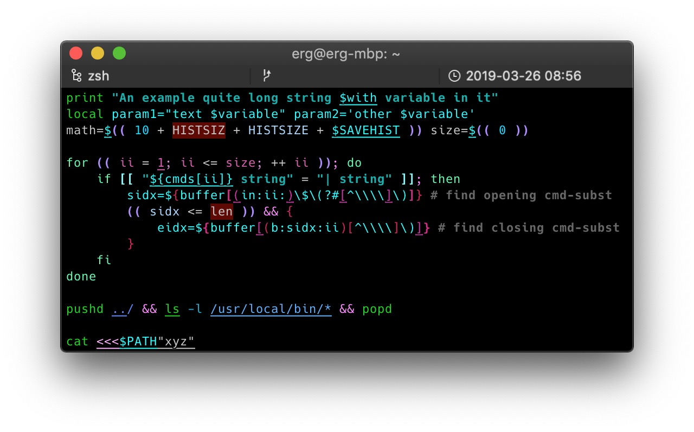

# grayt-FSyH-theme
[UNDER CONSTRUCTION] My personal, colorful theme for the
[fast-syntax-highlighting zsh plugin](https://github.com/zdharma/fast-syntax-highlighting).

I'm still playing around with the colors. When I'm finished, I will update the
repo to include installation info, etc.

In the meantime, here's a screenshot of how it currently looks.

If you want to use it now, feel free to do so. If you have
`fast-syntax-highlighting` installed, just run `fast-theme` and pass the [ini
file](lib/grayt.ini) as the argument.

There are a few highlights that I haven't figured out yet. I've switched these
to a bright green background so if I see something with that color, I can
determine what it is. That being said, if you see anything with bright green
background color, or just know what these highlight, please submit an issue with
a screenshot so I can add a real color to it.

